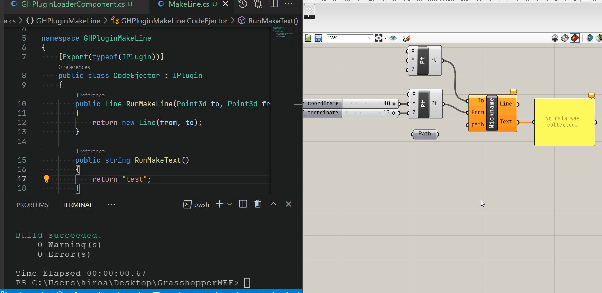

# MEF for Grasshopper Plugin

## What is MEF?

- [MEF (Managed Extensibility Framework) - Microsoft Docs](https://docs.microsoft.com/ja-jp/dotnet/framework/mef/)
- [Managed Extensibility Framework入門 まとめ](https://blog.okazuki.jp/entry/20110507/1304772329)

## About this repository

I saw [New way to load a C# .net plugin](https://discourse.mcneel.com/t/new-way-to-load-a-c-net-plugin/31284) on Rhinoceros Forums and it looked interesting, so I'm trying it out. I'm trying it out.

The basic idea is as in the following article, but the article is for Rhino commands, so I'm making one for Grasshopper

https://www.codeproject.com/Articles/1091178/Managed-Extensibility-Framework-MEF-Plugin-for-Rhi

Rhino command version [here](https://github.com/hrntsm/MEF-for-Rhinocoros-Plugin)

## LICENSE

The original article was published under [The Code Project Open License (CPOL) 1.02](https://www.codeproject.com/info/cpol10.aspx).

This repository is under [MIT License](https://github.com/hrntsm/MEF-for-Rhinocoros-Plugin/blob/main/LICENSE)

## How to use

For more detail, please see the original article.

1. Build the solution
1. Load GHPluginLoader.gha in GHPluginLoader/bin/ so that the "LoadPlugin" component can be used.
1. When you execute the LoadPlugin component, it needs dll path, so refer to the dll file where the component you want to execute is actually written.
    - As an example, the csproj to create a Line is GHPluginMakeLine, so refer to the dll file in its bin
1. The component described in MakeLine.cs will be executed.
1. Normally, Rhino needs to be restarted when the component code is rewritten, but in this case, MEF is used to load dll each time the LoadPlugin component is executed, so there is no need to restart.
1. ;DDDDDDDDDDDDDDD

## DEMO

